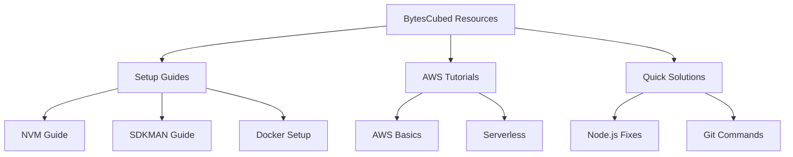

# Welcome to BytesCubed! 

<div align="center">
  <p align="center">
    
  </p>
  
  <p align="center">Tech Content Creator</p>
  
  <p align="center">
    <a href="https://youtube.com/@bytescubed">
      
    </a>
    <a href="https://tiktok.com/@bytescubed">
      
    </a>
    <a href="https://github.com/bytescubed">
      
    </a>
  </p>
</div>

<br/>


## 🎯 What You'll Find Here

Welcome to my tech universe! Here you'll discover:
- 🛠️ Development environment setup guides
- 🚀 Productivity tools and tips
- 💡 Quick solutions to common problems
- 🌐 Tech content in English (learning together!)

<br/>

## 💻 Content Focus

```typescript
class ContentCreator {
  name: string = 'BytesCubed';
  focus: string[] = ['DevTools', 'Best Practices', 'Learning English'];
  
  constructor() {
    this.createContent();
  }
  
  contentTypes(): Content[] {
    return [
      { platform: 'YouTube', type: 'In-depth Tutorials', duration: 'Comprehensive' },
      { platform: 'TikTok', type: 'Quick Tips', duration: '60s' },
      { platform: 'GitHub', type: 'Code Resources', duration: 'Always Available' }
    ];
  }
  
  technologies(): string[] {
    return [
      'Node.js', 'Java', 'Docker',
      'AWS', 'Spring', 'React/Angular'
    ];
  }
}
```

<br/>

## 🎥 Latest Content

<div align="center">
  <table>
    <tr>
      <td align="center">
        
      </td>
      <td align="center">
        
      </td>
    </tr>
    <tr>
      <td align="center">
        
      </td>
      <td align="center">
        
      </td>
    </tr>
  </table>
</div>

<br/>

## 🛠 Resource Categories

<div align="center">
  <p>
    
    
  </p>
  <p>
    
    
  </p>
</div>

<br/>

## 📊 Repository Structure



<br/>

---

<div align="center">
  
  
  <h3>🤝 Let's Learn Together!</h3>
  
  <i>"Every expert was once a beginner" - Helen Hayes</i>
</div>
