# Welcome to Bytes³ Cubed! 

<div align="center">
  
  
  <br>
  
  [](https://youtube.com/@bytes3cubed)
  [](https://tiktok.com/@bytes3cubed)
  [](https://github.com/bytes3cubed)
</div>


## 🎯 What You'll Find Here

Welcome to my tech universe! Here you'll discover:
- 🛠️ Development environment setup guides
- 🚀 Productivity tools and tips
- 💡 Quick solutions to common problems
- 🌐 Tech content in English (learning together!)

## 💻 Content Focus

```typescript
class ContentCreator {
  name: string = 'Bytes³ Cubed';
  focus: string[] = ['DevTools', 'Best Practices', 'Learning English'];
  
  constructor() {
    this.createContent();
  }
  
  contentTypes(): Content[] {
    return [
      { platform: 'YouTube', type: 'In-depth Tutorials', duration: 'Comprehensive' },
      { platform: 'TikTok', type: 'Quick Tips', duration: '60s' },
      { platform: 'GitHub', type: 'Code Resources', duration: 'Always Available' }
    ];
  }
  
  technologies(): string[] {
    return [
      'Node.js', 'Java', 'Docker',
      'AWS', 'Spring', 'React/Angular'
    ];
  }
}
```

## 🎥 Latest Content

<div align="center">
  <table>
    <tr>
      <td align="center">
        
      </td>
      <td align="center">
        
      </td>
    </tr>
    <tr>
      <td align="center">
        
      </td>
      <td align="center">
        
      </td>
    </tr>
  </table>
</div>

## 🛠 Resource Categories

<div align="center">
  
  
  
  
  
  
</div>

## 📊 Repository Structure

```mermaid
graph TD
    A[Bytes³ Cubed Resources] --> B[Setup Guides]
    A --> C[AWS Tutorials]
    A --> D[Quick Solutions]
    B --> E[NVM Guide]
    B --> F[SDKMAN Guide]
    B --> G[Docker Setup]
    C --> H[AWS Basics]
    C --> I[Serverless]
    D --> J[Node.js Fixes]
    D --> K[Git Commands]
```



---

<div align="center">
  
  
  ### 🤝 Let's Learn Together!
  
  _"Every expert was once a beginner" - Helen Hayes_
</div>
